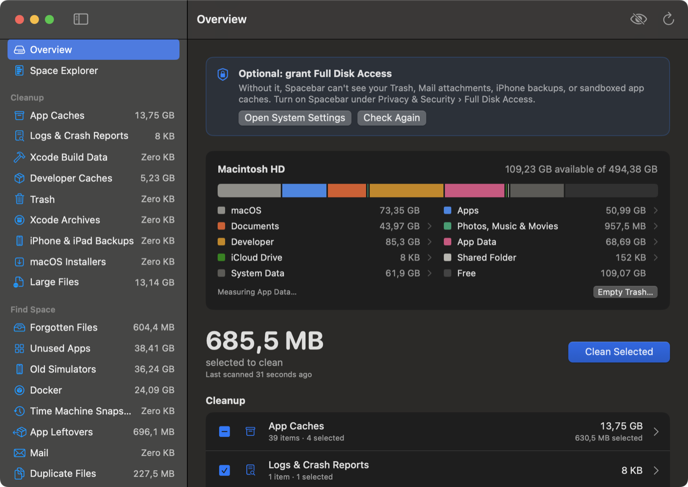
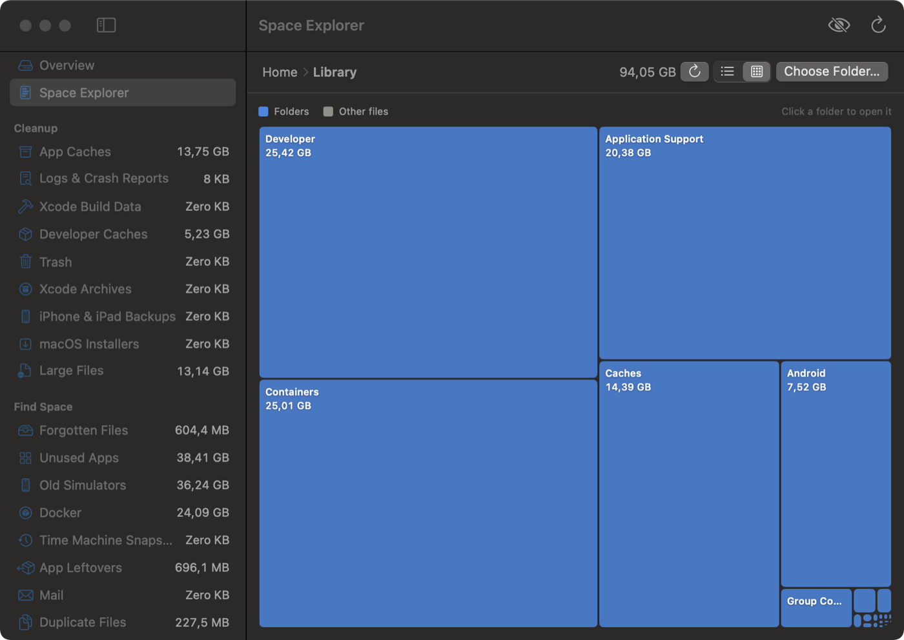
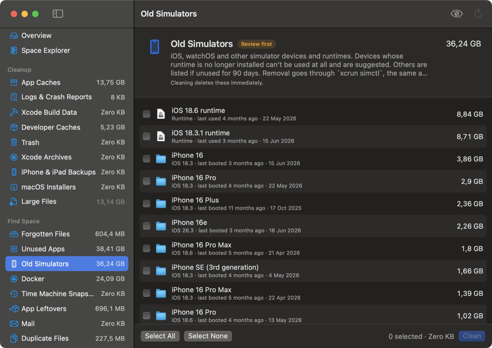
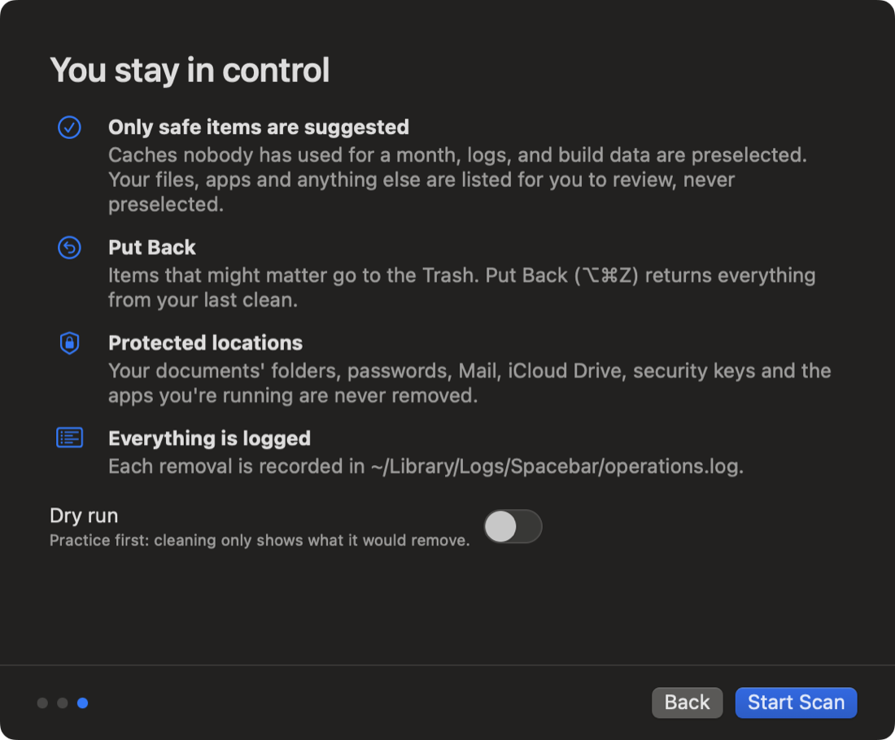

<p align="center"></p>

# Spacebar

**A free, open-source disk space analyzer and cleaner for Mac.** It shows what's using your disk and helps you safely remove caches, logs, build data, and leftovers. [Website](https://ovedaydin.github.io/spacebar/)

- **Disk breakdown.** See what your disk is used for (macOS, Apps, Documents, Developer, App Data, Shared, System Data…), measured rather than estimated. Click a category to explore it.
- **Space Explorer.** Drill into any folder as a sorted list or a treemap, on any drive. Search, filter by type, Quick Look (space bar), keyboard navigation and multi-select. Subfolders are measured in the same pass, so opening them is instant.
- **Uninstaller.** Drop an app on the window (or use Uninstall… / ⇧⌘U) to remove it with its data in ~/Library: app support, caches, containers, settings, saved windows, launch agents. Put Back restores it all.
- **Automatic (opt-in).** A weekly clean of suggested caches and logs, and emptying what Spacebar moved to the Trash after 7 days.
- **System Data, explained.** Click System Data or macOS to see what's in it, part by part (swap, temporary files, logs, system-wide app support, a waiting macOS update, snapshots), whether each is safe to remove, and a fix where there is one.
- **Your own rules.** For example "DMGs and ZIPs in Downloads older than 30 days" or "node_modules in projects untouched for 3 months". Rules show up as categories, work in the `spacebar` command and, if you like, in automatic cleaning.
- **History with undo.** Every clean is listed with Put Back while its items are still in the Trash.
- **Forgotten file reminders.** At most once a week, a notification about a big file you left in Downloads or on the Desktop, with Keep and Move to Trash.
- **Live, and instant at launch.** Sizes update by themselves as files change (FSEvents), re-measuring only the folders that changed, including changes made while Spacebar wasn't running.
- **What grew.** Spacebar keeps a light history of each measurement and shows which folders grew in the last week, so runaway caches and VM images get caught early.
- **External drives.** A breakdown of any connected drive's largest folders, with Eject.
- **Terminal, Shortcuts and Finder.** A `spacebar` command (`spacebar clean --safe --dry-run`), Shortcuts actions such as **Free Up Space**, and **Show in Spacebar** when you right-click a folder in Finder.
- **Menu bar & alerts.** Available space in the menu bar, one-click cleaning of safe items, and a notification when the disk is almost full.
- **Trash that frees space, and undo.** After a clean, **Delete Now** permanently removes just what Spacebar moved to the Trash, and **Put Back** (⌥⌘Z) restores it. Empty Trash is built in.
- **Remembers results.** The last scan is shown immediately at launch and refreshed in the background.
- **Cleanup.** Finds app caches, logs, Xcode data, package-manager caches, the Trash, old downloads, large files, iPhone backups, Mail attachments, and macOS installers.
- **Safe by design.** You review everything first. "Review" categories are never preselected. Most Apple caches are left alone, apps that are running are skipped, and every removal is logged.
- **Fast and accurate.** A parallel `getattrlistbulk` scanner that is about 4× faster than `du`, with matching totals (see [Benchmarks](#benchmarks)).
- **Private.** No network access, no telemetry, no accounts.
- **In your language.** English, Turkish, Spanish and German, with VoiceOver labels and keyboard navigation.

Requires macOS 13 Ventura or later, on Apple silicon or Intel.



| Space Explorer (treemap) | Old simulators |
|---|---|
|  |  |

## Install

### Homebrew (recommended)

```sh
brew install --cask ovedaydin/tap/spacebar
```

### Install script

```sh
curl -fsSL https://raw.githubusercontent.com/ovedaydin/spacebar/main/install.sh | bash
```

The script downloads the latest release, checks its SHA-256, and installs it into `/Applications`. It also links the `spacebar` command when it can do so without sudo.

### Manual download

1. Download `Spacebar-x.y.z.dmg` from [Releases](https://github.com/ovedaydin/spacebar/releases) and drag Spacebar to Applications.
2. Spacebar isn't notarized by Apple yet, so the first launch is blocked:
   1. Open Spacebar. When macOS says it can't verify the app, click **Done**.
   2. Open **System Settings → Privacy & Security**, scroll down, and click **Open Anyway** next to Spacebar.
   3. Confirm with your password.

   You only need to do this once. To skip it, run `xattr -dr com.apple.quarantine /Applications/Spacebar.app`.

On first launch, a short walkthrough explains Full Disk Access and how Spacebar keeps you safe:

<p align="center"></p>

## Command line, Shortcuts and Finder

Homebrew installs a `spacebar` command (it's the app's own binary, so it cleans with exactly the same rules):

```sh
spacebar status                    # free space on the startup disk
spacebar scan                      # sizes and suggestions for every category
spacebar clean --safe --dry-run    # what a safe clean (caches and logs nobody used recently) would remove
spacebar clean --safe              # do it (asks first; add --yes in scripts)
spacebar clean logs devcaches      # Spacebar's suggestions in specific categories
spacebar show ~/Downloads          # open a folder in Space Explorer
```

Only items Spacebar suggests are removed: the same ones it preselects in the app. Your Dry Run setting, Exclusions and "unused for" days apply, and `--json` prints machine-readable results. The terminal's own Full Disk Access decides what it can scan.

In **Shortcuts**, Spacebar adds **Free Up Space** (with an optional dry run; returns the bytes freed), **Get Available Space**, and **Show Folder in Spacebar**. You can also ask Siri to "Free up space with Spacebar".

In **Finder**, right-click a folder and choose **Show in Spacebar** (under Quick Actions or Services). Links of the form `spacebar://show?path=/some/folder` do the same.

## Permissions

Spacebar works without special permissions, but some locations are hidden from apps by macOS. To include them, grant **Full Disk Access**:

1. Open **System Settings → Privacy & Security → Full Disk Access**.
2. Turn on Spacebar.
3. Quit and reopen Spacebar.

With Full Disk Access, Spacebar can also clean:

- the Trash
- Mail attachments
- iPhone backups
- caches of sandboxed apps

The **Old Downloads** and **Large Files** scans only run when you ask, because reading Desktop, Documents, and Downloads makes macOS show privacy prompts.

## What gets cleaned

| Category | Default | How it's removed |
|---|---|---|
| App caches (`~/Library/Caches`, container caches) | Suggested if unused for 30+ days | Deleted |
| Logs & crash reports | Selected | Deleted |
| Xcode: DerivedData, Products, simulator caches, old DeviceSupport (keeps the newest 2) | Suggested if unused for 30+ days | Deleted |
| Developer caches: npm, Yarn, Bun, Cargo, Gradle, SwiftPM, uv, … | Suggested if unused for 30+ days | Deleted |
| Trash | Selected | Deleted |
| Xcode Archives, iPhone backups, Mail attachments, macOS installers | Review | Moved to Trash |
| Large Files (over 500 MB) | Review, on demand | Moved to Trash |

**Why the age rule:** a cache an app wrote to recently will just be rebuilt, so deleting it frees space only briefly.

- "Last used" is the newest modification date of anything inside the folder. Access times aren't reliable on APFS, so they aren't used.
- You can change the threshold on the category page: 1 week, 1 month, 3 months, or 6 months.
- Caches with no matching installed app are suggested after 7 days.
- Caches of apps that are running are never suggested.

### Find Space

| Category | What it finds | Suggested | Removal |
|---|---|---|---|
| Forgotten Files | Items in Downloads (30+ days) and on the Desktop (90+ days) not opened or changed since, using Spotlight's open records | Installers for apps you already have, archives already unzipped, and installers/archives with no open recorded in 6 months. Never photos, videos, music, documents, or Desktop items | Trash |
| Unused Apps | Your apps, least recently used first. Uses Spotlight's last-used date plus traces apps leave when they run | Never | Trash (asks for a password if needed) |
| Old Simulators | Simulator devices whose runtime is gone, and devices or runtimes unused for 90+ days | Unusable devices | `xcrun simctl delete` |
| App Leftovers | Data of apps that are no longer installed (Application Support, containers, web data) | Bundle-ID matches that are web data or unchanged for 90+ days; name-only matches are left for review | Trash |
| Docker | Build cache, unused images, stopped containers and unused volumes, via Docker's own prune commands | Build cache. Volumes never | `docker … prune` |
| Time Machine Snapshots | Local snapshots on the startup disk | Never | `tmutil deletelocalsnapshots /` |
| Mail | Opened attachments, plus cached attachments of server-synced accounts (IMAP, Exchange, Gmail, iCloud), all or only those older than a year. Never mailboxes, POP or "On My Mac" | Never | Trash |
| Keep in iCloud Only | Large iCloud Drive files also stored on this Mac. The local copy is removed; the file stays in iCloud | Not opened in 90 days | Local copy removed (nothing deleted) |
| Developer Tools | Unused Android system images, emulators, old build-tools, extra Xcode copies, old JetBrains data, LM Studio models, old Homebrew versions, git repos to compact | Unused Android images, old JetBrains caches, old Homebrew versions | Deleted or Trash; `git gc` runs in Terminal |
| Messages Attachments | Attachments received more than a year ago, grouped by year | Never | Trash |
| Similar Photos | Bursts and repeated shots (taken within a minute, nearly identical by on-device Vision analysis) in your Photos library and image folders. Keeps the favorite or highest-resolution shot. iCloud-only photos aren't downloaded | Never | Photos: Recently Deleted (30 days). Files: Trash |
| Duplicate Files | Identical files over 1 MB, matched by size, then partial and full SHA-256 hashes. APFS clones, hard links, iCloud-only files, build output and files inside git repos are excluded | Never | Trash |
| Project Build Files | `node_modules`, `target`, `build`, `Pods`, `.venv`, … next to their project file | Projects untouched for 90+ days | Deleted (rebuildable) |

Anything can be hidden from cleanup with **Never Show in Cleanup** (right-click); manage the list in Settings › Exclusions. Developer tools you're using (`xcode-select`) are never removed. SSH keys, certificates, and shell configuration files are locked in Space Explorer.

**Never touched:**

- Keychains, Mail, Messages, iCloud Drive, Group Containers, Preferences, and whole app containers.
- Model weights (Ollama, LM Studio, Hugging Face) and dependency stores like `~/.m2`.
- Most `com.apple.*` caches. Some hold state, and removing them causes problems such as blank System Settings panes or iCloud re-syncs.

The rules are in [`PathRules.swift`](Sources/SpacebarCore/PathRules.swift), and every path is checked again right before it is removed.

**Scan cache.** Results are stored in `~/Library/Caches/<bundle id>/` (`catalog.json`, `explorer.json`). Cached sizes are shown first and always measured again, because a folder's size can change deep inside it without its own date changing.

**Dry Run** (eye icon in the toolbar) simulates a cleanup and only writes what it would remove to `~/Library/Logs/Spacebar/operations.log`.

## Benchmarks

`spacebar-bench` is a read-only command-line tool that can't delete files. It compares Spacebar's scanner with `FileManager` and `du`:

```sh
swift run -c release spacebar-bench                       # ~/Library/Caches and ~/Library/Developer
swift run -c release spacebar-bench --path ~ --runs 3     # any folder
swift run -c release spacebar-bench --catalog             # time the cleanup scan the app runs
swift run -c release spacebar-bench --tree 2              # one-pass subfolder sizes, checked against separate scans
```

`--algos` compares eleven scanning approaches on each `--path`. Results on an 8-core Apple silicon Mac (macOS 15.7), median of 5 warm rounds in rotated order:

| Approach | `~/Library/Caches` (288k files) | `~/Library/Developer` (297k) | `/Applications` (381k) | `~/Documents` (329k) |
|---|---|---|---|---|
| **Spacebar: `getattrlistbulk`, 8 workers, 128 KB, depth-first, clone-aware** | **0.48 s** | **2.46 s** | 1.12 s | **1.57 s** |
| … 4 / 16 / 32 workers | 0.87 / 0.59 / 0.57 s | 2.45 / 3.71 / 3.73 s | 1.77 / 1.09 / 1.05 s | 1.74 / 1.79 / 1.89 s |
| … 32 KB / 512 KB buffer | 0.62 / 0.62 s | 2.86 / 2.91 s | 1.24 / 1.25 s | 1.71 / 1.73 s |
| … breadth-first | 0.54 s | 3.03 s | 1.32 s | 1.70 s |
| … without clone lookups | 0.47 s | 2.75 s | 1.12 s | 1.62 s |
| `fts` (one thread) | 1.82 s | 5.82 s | 4.04 s | 5.12 s |
| `readdir` + `fstatat`, 8 threads | 4.78 s | 2.81 s | 2.15 s | 2.12 s |
| `FileManager` | 4.97 s | 10.39 s | 8.55 s | 8.70 s |
| `du -skx` | 7.73 s | 9.22 s | 7.12 s | 7.44 s |

The default is fastest or within a few percent everywhere. More threads help on big app bundles but cost about 50% on deep trees. All approaches find the same files. Spacebar's totals are slightly below `du` (up to 0.7% in Documents) because APFS clones are counted once.

How the scanner works:

- One `getattrlistbulk(2)` call returns metadata for many entries at once.
- Worker threads share a flat work queue.
- It counts allocated size, so sparse and compressed files are measured correctly.
- Hard links are counted once.
- It never follows symlinks, crosses into other volumes, or descends into firmlinks.
- It sets `IOPOL_MATERIALIZE_DATALESS_FILES_OFF`, so scanning never downloads iCloud-only files.
- **APFS clones count once.** For files that may share blocks, it reads their private size and clone ID, so a Finder duplicate isn't counted twice. Edited clones are counted conservatively, because APFS doesn't expose which file they still share blocks with.

## Security

See [SECURITY.md](SECURITY.md): how deletions are validated, why external tools are signature-checked, and how to report a vulnerability privately.

## Build from source

```sh
git clone https://github.com/ovedaydin/spacebar && cd spacebar
swift run Spacebar                # run the app directly
ARCHS=arm64 ./scripts/build-app.sh  # build dist/Spacebar.app (drop ARCHS for a universal build)
./scripts/install-local.sh          # build and install to /Applications (replaces the running copy)
./scripts/package.sh                # create dist/Spacebar-x.y.z.{zip,dmg} and SHA256SUMS.txt
```

Tests: `swift test` runs the path-rule, scanner (against `du`, with hard links, symlinks and APFS clones), suggestion, duplicate, Docker-parsing and cleaner tests. The cleaner tests only create and remove their own files in `~/Library/Caches/spacebar-tests-*`. CI runs them on every push.

The project uses Swift Package Manager with no Xcode project:

- `SpacebarCore`: a read-only library for scanning and the cleanup catalog.
- `Spacebar`: the SwiftUI app. It is the only part that can delete files.
- `spacebar-bench`: the benchmark tool.

### Translations

Strings live in `packaging/Localizable.xcstrings` (open it in Xcode, or edit the JSON). Each build syncs new strings from the code into it and compiles it into the app. Both steps need Xcode; with only the Command Line Tools, the app builds in English. To add a language, add it to `CFBundleLocalizations` in `packaging/Info.plist` and translate the catalogs in `packaging/`.

## Releasing (maintainers)

1. **One-time: create a signing certificate.** Run `./scripts/create-signing-cert.sh` and add the three secrets it prints to the repository.
   - A stable self-signed certificate keeps users' Full Disk Access across updates. With ad-hoc signing, users have to grant it again after every update.
   - Back up the `signing/` folder. It holds the code-signing certificate and the Sparkle update key; losing the update key means existing installs can't verify future updates.
2. **Optional: set up a Homebrew tap.**
   1. Create a repository named `ovedaydin/homebrew-tap`.
   2. Copy [`packaging/homebrew/spacebar.rb`](packaging/homebrew/spacebar.rb) into it as `Casks/spacebar.rb`.
   3. Add a `TAP_TOKEN` secret: a fine-grained token with Contents read/write access to the tap repository.
3. **Auto-updates (Sparkle).** `signing/sparkle_private_key` was created with Sparkle's `generate_keys`. Add its contents as the secret `SPARKLE_PRIVATE_KEY`. Each release then publishes a signed `appcast.xml`, and the app checks `…/releases/latest/download/appcast.xml` daily. The public key is in `packaging/app.env`.
4. **Publish a release:** `git tag v0.1.0 && git push --tags`.
   - GitHub Actions builds a universal app, signs it, creates the ZIP, DMG, and checksums, publishes the release, and updates the tap.

**With an Apple Developer account:**

- Set `SIGN_IDENTITY` to your "Developer ID Application" certificate.
- Set the repository variable `NOTARIZE=true` and add the secrets `ASC_KEY_P8`, `ASC_KEY_ID`, and `ASC_ISSUER_ID`.
- Releases (the app and the DMG) are then notarized, so there's no Gatekeeper prompt. Remove the `postflight_steps` block from the cask.
- Developer ID builds use `packaging/Spacebar.entitlements`, which keeps library validation on. Self-signed builds need `Spacebar.selfsigned.entitlements` to load Sparkle, because they have no Team ID.

## License

MIT
